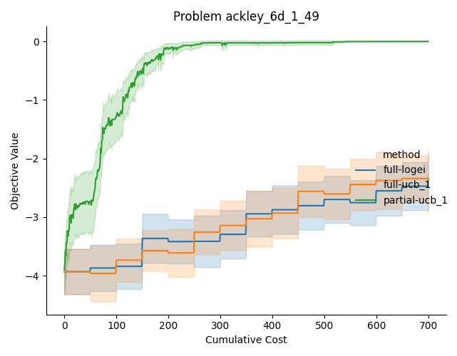
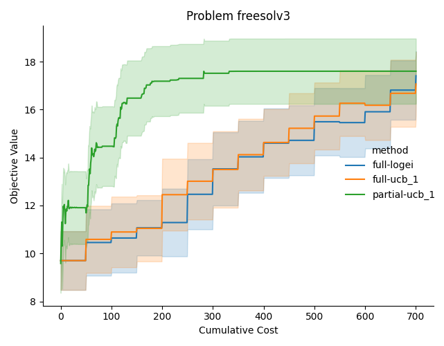
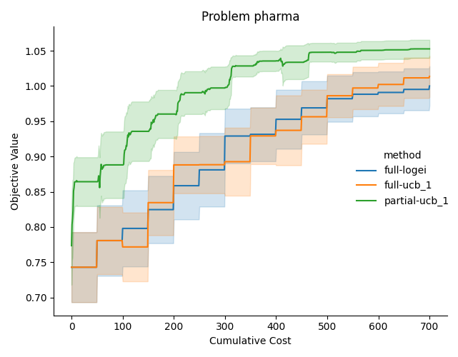

# partial_ucb

- [Overview](#overview)
- [Problem Definition](#problem-definition)
- [Algorithm](#algorithm)
- [Usage](#usage)
- [Experiments](#experiments)
- [TODO](#todo)
- [References](#references)

## Overview

This repository proposes an algorithm for efficient optimization using partial evaluation in black-box function optimization.
The aim of this algorithm is to optimize the final objective function while minimizing the number of evaluations of the black-box function.

## Problem Definition

Consider the following problem:
Let $f : X \to \mathbb{R}$ be an objective function.
The domain $X$ is defined as $X = \prod_{i=1}^d [l_i, u_i]$.

$f$ is represented as a composition of multiple functions $f_i: \mathbb{R}^{k_i} \to \mathbb{R}$.
Let $F = \{f_1, \dots, f_m\}$.
$g_j \in F (j=1,\dots, n)$ corresponds to one of the functions in $F$.
$g_n$ represents the final output of $f$.
$O_j(x)$ represents the output of $g_j$ when the input is $x \in X$.
And $I_j(x)$ represents the input to $g_j$ when the input is $x$. The elements of $I_j(x)$ represent either parts of $x$ or parts of $O_k(x) (k \neq j)$.
Also, let $f_{i_j}$ be the function $f_i$ that corresponds to $g_j$.

For example, consider a function like $f(x) = \sin(x_1) + \cos(x_2)$.
In this case, $f_1(x) = \sin(x)$, $f_2(x) = \cos(x)$, $f_3(x_1, x_2) = x_1 + x_2$, and
$g_1 = f_1$, $g_2 = f_2$, $g_3 = f_3$.
Also, $I_1(x) = (x_1), I_2(x) = (x_2), I_3(x) = (O_1(x)_1, O_2(x)_1)$.

Each $f_i (i=1,\dots, m)$ is classified into one of the following:

<dl>
   <dt>Known functions</dt>
   <dd>
      A function whose values and gradients can be evaluated at low cost.
   </dd>
   <dt>Black-box functions</dt>
   <dd>
      A function whose values can be evaluated at high cost, but gradients cannot be computed.
   </dd>
</dl>

Let $F_B$ be the set of $f_i$ that are black-box functions, and let $I_B$ be the set of indices corresponding to these black-box functions, that is, $I_B = \{ i \mid f_i \in F_B \}$.

Under these conditions, we aim to optimize $f$. However, evaluating $f$ is costly due to the black-box functions it contains. Therefore, we aim to optimize $f$ while minimizing evaluation costs by individually evaluating each $f_i \in F_B$ that comprises $f$.

## Algorithm

We propose the following algorithm for the above problem:

1. Initial data collection
   1. For each $f_i \in F_B$, randomly sample a certain number of points from its domain and evaluate $f_i$. Let the evaluated data be $D_i = \{(x_k, f_i(x_k))\}_{k=1}^{n_i}$.
2. Adaptive data collection

   Iterate the following steps until the evaluation budget is exhausted:

   1. For each $f_i \in F_B$, fit a Gaussian process $GP_i$ using the data $D_i$.
   2. Define $\hat{f}_i(x_i, z_i) := \mu_i(x) + \alpha z_i \sigma_i^2(x_i)$, where $\mu_i$ and $\sigma_i^2$ are the mean and variance functions of $GP_i$, and $\alpha > 0$ is a hyperparameter.
   3. Optimize $f$ using $\hat{f}_i$ instead of $f_i \in F_B$ over $x \in X$ and $z_i \in [-1, 1]\ (i \in I_B)$. Let the obtained solution be $x^\ast, z^\ast$.
   4. Calculate $r_j(x^\ast)$ (defined below) for each $f_{i_j}(I_j(x^\ast))$.
   5. Evaluate $f_{i_j}(I_j(x^\ast))$ that maximizes $r_j(x^\ast)$. Add the evaluation result to $D_{i_j}$.

3. Output solution
   1. For each $f_i \in F_B$, fit a Gaussian process using $D_i$. Let the resulting mean and variance functions be $\mu_i, \sigma^2_i$.
   2. Optimize $f$ using $\mu_i$ instead of $f_i \in F_B$. Let the obtained solution be $x^\ast$.
   3. Output $x^\ast$.

### Definition of $r_j(x^\ast)$

$r_j(x^\ast)$ is defined as follows:

$$
r_j(x^\ast) := \frac{1}{c_j} \left(\frac{\partial \bar{f}(x^\ast)}{\partial \mu_{i_j}(x^\ast)} \right)^2 \cdot \sigma^2_{i_j}(I_j(x^\ast))
$$

Here, $\bar{f}(x)$ is $f$ defined using $\mu_i$ instead of $f \in F_B$, $c_j$ is the evaluation cost of $f_{i_j}(I_j(x))$.
In other words, $r_j$ is the product of the uncertainty (variance) of $f_{i_j}(I_j(x))$ and its impact on the final objective function value (gradient).

## Usage

An example of usage is available in `examples/example.ipynb`.

## Experiments

The experiments are conducted in `run_all_experiments.py`, which runs the proposed algorithm and some baselines on several problems and plots the results. The following figures show the results of the experiments. They display the progression of the objective function value of the solution against the cost used for several problems used in [1], comparing the proposed algorithm (`partial-ucb_1`) with standard UCB (`full-ucb_1`) and logEI[2] (`full-logei`). It can be seen that the proposed algorithm performs more efficient optimization than the baselines across all problems.

  
  
  

## TODO

- Comparison with partial-KGFN [1]

## References

- [1] [Buathong, Poompol, et al. "Bayesian Optimization of Function Networks with Partial Evaluations." International Conference on Machine Learning. PMLR, 2024.](https://proceedings.mlr.press/v235/buathong24a.html)
- [2] [S. Ament, S. Daulton, D. Eriksson, M. Balandat, and E. Bakshy. Unexpected Improvements to Expected Improvement for Bayesian Optimization. Advances in Neural Information Processing Systems 36, 2023.]()